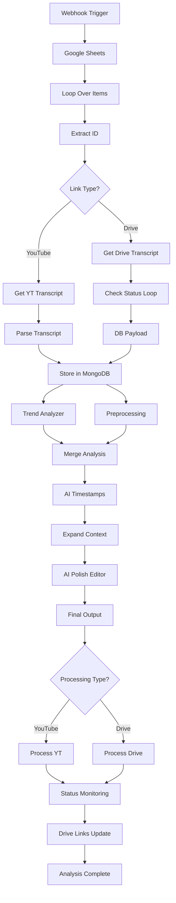

# N8N AI YouTube Shorts Generator Workflow

## Overview

This N8N workflow is an automated AI-powered system that processes educational videos (primarily Hindi content for JEE/NEET exam preparation) and generates viral YouTube Shorts clips. The system integrates multiple AI services, video processing tools, and cloud storage to create a complete end-to-end pipeline from video link to ready-to-publish clips.

## 🎯 Core Functionality

- **Automated Video Processing**: Processes both YouTube and Google Drive video links
- **AI-Powered Transcript Generation**: Uses AssemblyAI for Hindi transcription
- **Viral Content Analysis**: AI trend analysis for identifying viral potential
- **Intelligent Clip Selection**: Multi-stage AI analysis for optimal clip timing
- **Automated Video Rendering**: Creates YouTube Shorts format (9:16 aspect ratio)
- **Cloud Storage Integration**: Automatic upload to Google Drive
- **Progress Tracking**: Real-time status updates in Google Sheets

## 🏗️ Workflow Architecture

### Input Sources
```
Google Sheets → Video Links (YouTube/Drive) → Processing Pipeline
```

### Main Processing Flow
```
1. Webhook Trigger
2. Link Analysis & ID Extraction  
3. Transcript Generation
4. AI Content Analysis
5. Clip Identification & Refinement
6. Video Processing & Rendering
7. Storage & Distribution
8. Status Updates & Reporting
```

## 📋 Detailed Node Analysis

### 1. Entry Points & Triggers

#### **Webhook** (`trigger-video-processing`)
- **Purpose**: HTTP endpoint to initiate video processing
- **Endpoint**: `POST /trigger-video-processing`
- **Trigger**: External systems or manual execution
- **Output**: Starts the entire workflow pipeline

#### **Manual Trigger**
- **Purpose**: Development and testing trigger
- **Usage**: Manual workflow execution during development

### 2. Data Management Layer

#### **Google Sheets Integration** (`Get row(s) in sheet`)
- **Purpose**: Fetches pending video links from management spreadsheet
- **Spreadsheet ID**: `16QpFaWxYfBPDNephKhUDKlAw-t7PWW3s7cwec054BBs`
- **Columns**: Video Link, Type, VideoId, Transcript, Status, Clip data
- **Authentication**: Google Sheets OAuth2 API

#### **MongoDB Storage** (`Store in MongoDB`)
- **Collection**: `transcripts`
- **Purpose**: Persistent storage for transcript data
- **Schema**: VideoId, createdAt, transcriptText, transcriptSegments

### 3. Video Processing Core

#### **Loop Over Items** (Batch Processing)
- **Purpose**: Processes multiple video links in sequence
- **Type**: Split in batches for efficient processing
- **Flow Control**: Handles both YouTube and Drive links

#### **Extract ID** (Smart Link Parser)
```javascript
// Supports multiple link formats:
- YouTube: youtube.com/watch?v=, youtu.be/, youtube.com/shorts/
- Google Drive: drive.google.com/file/d/, docs.google.com/
```
- **Output**: VideoId, type (youtube/drive), VideoLink, Transcript status

### 4. Transcript Generation Pipeline

#### **Conditional Processing** (`If YT-1`, `If YT-2`)
- **YouTube Path**: Uses `youtube-transcript.io` API
- **Drive Path**: Uses custom backend with AssemblyAI
- **Logic**: Automatically routes based on detected link type

#### **YouTube Transcript** (`Get Transcript (YT)`)
- **API**: `youtube-transcript.io`
- **Authentication**: Basic auth token
- **Endpoint**: `POST /api/transcripts`
- **Input**: YouTube video IDs array
- **Output**: Raw transcript with timestamps

#### **Drive Transcript** (`Get Transcript(GDrive)`)
- **Endpoint**: Custom backend `/generate-transcript`
- **Method**: POST with VideoId and drive_url
- **Backend**: Python processor with AssemblyAI
- **Timeout**: 6000000ms (100 minutes) for large files

#### **Status Monitoring** (`Check Status`, `Is Completed?`)
- **Purpose**: Polls backend for transcript completion
- **Interval**: 30-second checks
- **Endpoint**: `/status/{VideoId}`
- **Retry Logic**: Continues until status = "completed"

### 5. AI Analysis Engine

#### **Trend Analyzer** (Market Intelligence)
```javascript
// AI Agent Configuration:
Model: GPT-4.1 (Azure OpenAI)
Purpose: Analyze current EdTech viral trends
Focus: JEE/NEET content, Hindi audience
Output: JSON with trending topics, keywords, content ideas
```

**Analysis Areas**:
- Trending topics in Indian EdTech
- Popular hashtags and keywords  
- Viral content patterns
- Engagement strategies
- Channel-specific observations (Physics Wallah, etc.)

#### **Timestamps** (Clip Identification)
```javascript
// Primary AI Analysis:
Input: Hindi transcript + trend analysis
Model: GPT-4.1
Task: Identify viral potential segments
Categories: Sarcastic Line, Shayari, Funny Joke, Emotional Story, etc.
Output: 10 potential clips with timestamps and confidence scores
```

**Selection Criteria**:
- Humor and relatability
- Emotional resonance  
- Educational value
- Trend alignment (15% weightage)
- Viral potential scoring

#### **Polished Timestamps** (Clip Refinement)
```javascript
// Expert Editor AI:
Purpose: Refine clips for maximum impact
Duration: 15-59 seconds per clip
Focus: Complete narrative arcs
Quality: Professional editing standards
```

**Refinement Process**:
1. Analyzes expanded context around each clip
2. Finds natural story beginnings and endings
3. Ensures complete jokes/stories
4. Optimizes for emotional impact
5. Maintains precise timestamp accuracy

### 6. Video Production Pipeline

#### **Expand Context** (Content Enhancement)
- **Purpose**: Adds context segments around identified clips
- **Context Window**: 4 segments before + 4 segments after
- **Output**: Enhanced transcript sections for AI editor

#### **Processing Handlers**
- **YouTube**: `Start Processing(YT)` → `/process-youtube`
- **Drive**: `Start Processing(GDrive)` → `/process-drive-clips`

**Processing Parameters**:
```json
{
  "VideoId": "extracted_id",
  "video_url": "source_link", 
  "clips": "ai_generated_timestamps"
}
```

#### **Backend Processing** (Python)
- **Video Download**: yt-dlp for YouTube, custom handler for Drive
- **Clip Creation**: FFmpeg with Shorts format (1080x1920)
- **Upload**: Google Drive API integration
- **Format**: MP4, optimized for mobile viewing

### 7. Quality Control & Data Management

#### **Transcript Processing** (`Parse Transcript`, `DB Payload`)
```javascript
// Data Transformation:
Input: Raw API transcript
Output: MongoDB-ready format
Fields: VideoId, createdAt, transcriptText, transcriptSegments
```

#### **Clip Data Management**
- **Initial Rows**: Basic clip information (Category, Reason, Confidence)
- **Polished Data**: Refined clips (Start, End, Text, Justification)  
- **Final Links**: Drive download URLs for generated clips

### 8. Status Tracking & Reporting

#### **Google Sheets Updates**
1. **Status and ID**: Initial processing start
2. **Update row in sheet**: Transcript link and "Analysing" status
3. **Append Initial Clip Rows**: Raw AI clip suggestions
4. **Update with Polished Data**: Refined clip timestamps
5. **Drive Links**: Final download URLs
6. **Analysis Complete**: Final status update

#### **Progress Monitoring**
- Real-time status updates in spreadsheet
- Automatic retry logic for failed operations
- Comprehensive error handling and logging

## 🔄 Data Flow Visualization



## 🛠️ Technical Configuration

### API Integrations

#### **AssemblyAI**
- **Purpose**: Hindi audio transcription
- **Model**: Universal-1 with Hindi language support
- **Cost**: ~$0.37 per hour of audio
- **Timeout**: 5 minutes with retry logic

#### **Azure OpenAI (GPT-4.1)**
- **Models**: 3 separate agents for different tasks
- **Usage**: Trend analysis, clip identification, clip refinement
- **Configuration**: Structured output parsers for consistent JSON

#### **YouTube Transcript API**
- **Service**: `youtube-transcript.io`
- **Authentication**: Basic token authentication
- **Rate Limits**: Managed through batch processing

### Storage Solutions

#### **Google Drive**
- **Purpose**: Video storage and sharing
- **API**: Drive v3 with OAuth2
- **Permissions**: Automatic public link generation
- **Organization**: Structured folder system

#### **MongoDB**
- **Database**: Transcript storage
- **Connection**: Authenticated cluster
- **Schema**: Flexible document structure
- **Indexing**: VideoId for fast retrieval

### Backend Services

#### **Custom Python Backend**
- **Framework**: Flask/FastAPI
- **Video Processing**: FFmpeg, yt-dlp
- **Transcription**: AssemblyAI integration
- **Timeout Handling**: Extended timeouts for large files

## 🎛️ Workflow Controls

### Error Handling
- **Retry Logic**: Automatic retries for failed operations
- **Timeout Management**: Progressive timeouts for different operations
- **Status Tracking**: Comprehensive error logging in sheets

### Performance Optimization
- **Batch Processing**: Efficient handling of multiple videos
- **Caching**: MongoDB storage prevents re-processing
- **Parallel Processing**: Independent clip generation

### Quality Assurance
- **Multi-stage AI Review**: 3-level AI analysis pipeline
- **Duration Validation**: 15-59 second clip requirements
- **Content Validation**: Trend alignment and viral potential scoring

## 📊 Output Formats

### Google Sheets Columns
```
Video Link | Type | VideoId | Transcript | Status | Clip ID | Start | End | Text | Category | Reason | Editor Justification | Drive Link | Confidence
```

### MongoDB Documents
```json
{
  "VideoId": "string",
  "createdAt": "ISO_date",
  "transcriptText": "formatted_transcript",
  "transcriptSegments": [
    {
      "start": "float_seconds",
      "dur": "duration",
      "text": "segment_text"
    }
  ]
}
```

### Final Clip Output
```json
{
  "VideoId": "source_id",
  "status": "completed",
  "clips_processed": "integer",
  "successful_clips": "integer", 
  "results": [
    {
      "clip_number": "integer",
      "category": "clip_type",
      "confidence": "float_0_to_1",
      "start_time": "float_seconds",
      "end_time": "float_seconds", 
      "drive_link": "download_url",
      "status": "success"
    }
  ]
}
```

## 🚀 Usage Instructions

### 1. Setup Requirements
- N8N instance with required node modules
- Google Sheets API credentials
- Azure OpenAI API access
- MongoDB connection
- Custom Python backend deployment

### 2. Triggering Workflow
```bash
# HTTP POST to webhook
curl -X POST https://your-n8n-instance/webhook/trigger-video-processing \
  -H "Content-Type: application/json" \
  -d '{"action": "process_videos", "videoCount": 1}'
```

### 3. Managing Input Data
1. Add video links to the designated Google Sheet
2. Ensure proper column headers match the workflow expectations
3. Monitor status updates in real-time

### 4. Output Access
- **Clips**: Google Drive links in the spreadsheet
- **Transcripts**: MongoDB collection for programmatic access
- **Status**: Real-time updates in Google Sheets

## 🔧 Maintenance & Monitoring

### Regular Checks
- API rate limits and quotas
- Storage capacity (Google Drive, MongoDB)
- Backend service health
- Transcript accuracy validation

### Performance Metrics
- Processing time per video
- Clip success rate
- AI accuracy scores
- User engagement with generated clips

### Troubleshooting
- Check webhook endpoint accessibility
- Verify API credentials and quotas
- Monitor backend service logs
- Validate Google Sheets permissions

## 📈 Future Enhancements

### Planned Features
- Multi-language support expansion
- Real-time processing notifications
- Advanced viral prediction models
- Automated publishing to social platforms
- Analytics dashboard for clip performance

### Scaling Considerations
- Horizontal backend scaling
- Database sharding for large volumes
- CDN integration for faster video delivery
- Load balancing for high-throughput processing

---

*This workflow represents a sophisticated AI-powered content creation pipeline specifically designed for the Indian educational technology market, with focus on Hindi language content and JEE/NEET exam preparation materials.* 