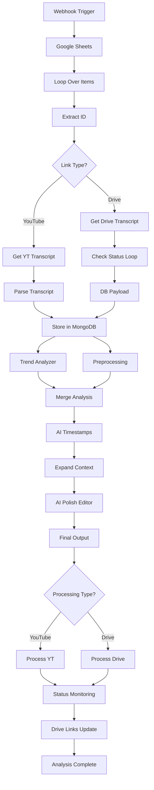

# PW Shorts: AI-Powered YouTube Shorts Generator

> **Transform long-form educational videos into viral-ready YouTube Shorts with a single click.  
> End-to-end AI pipeline: Google Sheets → n8n → Backend → AI Models → Google Drive → Frontend Dashboard.**

---

## Table of Contents

1. [Project Overview](#project-overview)
2. [System Architecture](#system-architecture)
   - [High-Level Flowchart](#high-level-flowchart)
   - [Component Breakdown](#component-breakdown)
3. [How It Works: End-to-End Pipeline](#how-it-works-end-to-end-pipeline)
   - [Step-by-Step Data Flow](#step-by-step-data-flow)
   - [Detailed Pipeline Stages](#detailed-pipeline-stages)
4. [Frontend: Features & UI](#frontend-features--ui)
   - [Dashboard](#dashboard)
   - [Video Upload](#video-upload)
   - [Clip Review](#clip-review)
   - [Analytics](#analytics)
   - [Settings](#settings)
   - [Dark Mode](#dark-mode)
5. [Backend: Features & API](#backend-features--api)
   - [Endpoints](#endpoints)
   - [Processing Logic](#processing-logic)
   - [Error Handling & Status](#error-handling--status)
6. [n8n Workflow: Orchestration & AI](#n8n-workflow-orchestration--ai)
   - [Workflow Structure](#workflow-structure)
   - [AI Analysis & Clip Generation](#ai-analysis--clip-generation)
7. [Google Sheets: Data Management](#google-sheets-data-management)
8. [Google Drive: Storage & Distribution](#google-drive-storage--distribution)
9. [Deployment & Setup](#deployment--setup)
10. [Advanced Features & Optimizations](#advanced-features--optimizations)
11. [Troubleshooting & FAQ](#troubleshooting--faq)
12. [Contributing](#contributing)
13. [License](#license)

---

## Project Overview

PW Shorts is a full-stack, AI-powered platform that automates the creation of YouTube Shorts from long-form educational videos. It leverages Google Sheets for input/output, a Vercel-hosted React frontend, a Railway-hosted Python backend, and a powerful n8n workflow for orchestration and AI-driven content analysis.

**Key Features:**
- Paste YouTube/Drive links → Get viral-ready Shorts in minutes
- AI-powered transcript, trend, and content analysis
- Multi-stage clip selection and professional editing
- Google Sheets as the single source of truth
- Real-time dashboard, analytics, and review UI
- Robust single-user locking and session management
- End-to-end error handling and status reporting

---

## System Architecture

### High-Level Flowchart

```mermaid
graph TD
    A[User Uploads Video Links (Frontend)] --> B[Google Sheets (Sheet1)]
    B --> C[n8n Workflow Trigger]
    C --> D[Link Analysis & ID Extraction]
    D --> E{Link Type?}
    E -->|YouTube| F[YouTube Transcript API]
    E -->|Drive| G[Backend Transcript (AssemblyAI)]
    F --> H[MongoDB Storage]
    G --> H
    H --> I[AI Trend Analysis (OpenAI GPT-4.1)]
    I --> J[AI Clip Selection & Refinement]
    J --> K[Backend Video Processing (Python)]
    K --> L[Google Drive Upload]
    L --> M[Google Sheets Update (Clips, Links, Status)]
    M --> N[Frontend Dashboard/Review]
```

### Component Breakdown

- **Frontend (Vercel, React + TS):** User interface for upload, review, analytics, and settings.
- **Google Sheets:** Central data hub for input, status, and output.
- **n8n Workflow:** Orchestrates the pipeline, manages AI analysis, and coordinates all services.
- **Backend (Railway, Python):** Handles video download, audio extraction, transcription, and clip generation.
- **AI Services:** AssemblyAI (transcription), Azure OpenAI GPT-4.1 (trend/content analysis).
- **MongoDB:** Stores transcripts and metadata.
- **Google Drive:** Stores and serves final video clips.

---

## How It Works: End-to-End Pipeline

### Step-by-Step Data Flow

1. **User uploads video links** via the frontend (YouTube or Google Drive).
2. **Links are written to Google Sheets** (Sheet1).
3. **n8n workflow is triggered** (polls for new links).
4. **Link analysis & ID extraction** (YouTube/Drive).
5. **Transcript generation:**
   - YouTube: Uses YouTube Transcript API.
   - Drive: Backend downloads video, extracts audio, transcribes via AssemblyAI.
6. **Transcripts stored in MongoDB**; clickable links added to Google Sheets.
7. **AI trend analysis** (OpenAI GPT-4.1) for viral content patterns.
8. **AI-powered clip selection** (up to 10 segments per video).
9. **Context expansion & professional editing** (AI refines clips for narrative, duration, and engagement).
10. **Backend processes video, generates clips** (FFmpeg, yt-dlp).
11. **Clips uploaded to Google Drive**; links updated in Google Sheets.
12. **Frontend dashboard updates in real-time**; users can review, download, and analyze clips.

---

### Detailed Pipeline Stages

#### 1. Input & Initialization
- User pastes video links in the frontend.
- Links are validated and written to Google Sheets.
- Sheet lock ensures only one user can process at a time.

#### 2. n8n Orchestration
- n8n polls Google Sheets for new links.
- Extracts video IDs and determines link type.
- Updates status in Google Sheets.

#### 3. Transcript Generation
- YouTube: Calls YouTube Transcript API.
- Drive: Backend downloads video, extracts audio, transcribes with AssemblyAI.
- Stores transcript in MongoDB; adds clickable link to Google Sheets.

#### 4. AI Analysis & Clip Selection
- Trend analysis using OpenAI GPT-4.1.
- AI selects up to 10 viral-potential segments.
- Expands context for each clip.
- AI editor refines clips for narrative, duration, and engagement.

#### 5. Video Processing & Clip Generation
- Backend downloads video (yt-dlp or Drive API).
- Extracts and processes clips (FFmpeg).
- Uploads clips to Google Drive.
- Updates Google Sheets with final links and status.

#### 6. Review & Analytics
- Frontend dashboard displays processing status, completed clips, analytics, and more.
- Users can review, download, and analyze clips.

---

## Frontend: Features & UI

### Dashboard

- **Overview of all videos:** Processing status, quick actions, and recent activity.
- **Stats grid:** Total, processing, completed, and failed videos.
- **Quick actions:** Upload new videos, review clips, view analytics.
- **Recent activity:** See what’s processing and what’s completed.

### Video Upload

- **Paste multiple YouTube/Drive URLs** (one per line).
- **Real-time validation** of URLs.
- **Upload warning modal:** Notifies if uploading will clear existing data.
- **Triggers n8n workflow** automatically.
- **Sheet lock:** Ensures only one user can upload/process at a time.

### Clip Review

- **Grouped and flat views:** Review all clips by video or as a flat list.
- **Clip details:** Category, reason, confidence, editor justification.
- **Preview and download:** Embedded Google Drive player and download links.
- **Expand/collapse controls:** For grouped view.

### Analytics

- **Metrics grid:** Total views, clip views, average watch time, engagement rate.
- **Top clips:** Most popular clips with stats.
- **Category breakdown:** Visualize content distribution.

### Settings

- **General:** Auto-process, default language, max clip duration, quality.
- **API:** AssemblyAI, OpenAI, Google Drive folder.
- **Notifications:** Email, processing alerts, weekly reports.
- **Security:** Two-factor auth, session timeout.
- **Appearance:** Theme (light/dark/auto), compact mode.

### Dark Mode

- **Toggle button:** Bottom-right floating button to switch between light and dark mode.
- **Persistence:** Remembers user’s choice across sessions.
- **Navbar always light:** For consistent branding.

---

## Backend: Features & API

### Endpoints

- `POST /process-youtube`: Process YouTube video with AI-generated clips.
- `POST /process-drive-clips`: Process Google Drive video with AI-generated clips.
- `POST /generate-transcript`: Generate transcript from Drive video.
- `GET /status/<VideoId>`: Check processing status.
- `GET /health`: Health check.
- `GET /endpoints`: List all endpoints.

### Processing Logic

- **YouTube:** Downloads video, extracts clips, uploads to Drive.
- **Drive:** Downloads video, extracts audio, transcribes, generates clips, uploads to Drive.
- **Status tracking:** Real-time updates via `/status/<VideoId>`.
- **Error handling:** Comprehensive logging, retries, and user notifications.

### Error Handling & Status

- **Validation:** URL, ID extraction, transcript generation, AI processing, video processing.
- **Recovery:** Status polling, retry logic, graceful degradation, user notification.
- **Status values:** started, downloading, setting_up, extracting_audio, transcribing, processing, uploading, cleaning_up, completed, failed.

---

## n8n Workflow: Orchestration & AI

### Workflow Structure

- **Webhook trigger:** Initiates processing.
- **Google Sheets integration:** Reads/writes video links, status, and results.
- **MongoDB storage:** Persists transcripts and metadata.
- **Batch processing:** Handles multiple videos sequentially.
- **Conditional routing:** YouTube vs Drive processing.

### AI Analysis & Clip Generation

- **Trend analysis:** OpenAI GPT-4.1 analyzes viral trends.
- **Clip selection:** AI identifies up to 10 viral-potential segments.
- **Context expansion:** Adds context for better narrative.
- **Professional editing:** AI editor refines clips for duration, engagement, and coherence.
- **Final processing:** Backend generates and uploads clips.

#### n8n Data Flow Diagram



---

## Google Sheets: Data Management

- **Sheet1:** Main data table (video links, status, transcript, clips, drive links, etc.).
- **Sheet2:** Locking and execution state (prevents concurrent processing).
- **Columns:** Video Link, VideoId, Transcript, Status, Clip ID, Start, End, Text, Category, Reason, Editor Justification, Drive Link, Confidence.

---

## Google Drive: Storage & Distribution

- **All generated clips are uploaded to Google Drive.**
- **Drive links are written back to Google Sheets and surfaced in the frontend.**
- **Users can preview and download clips directly from the dashboard.**

---

## Deployment & Setup

### Prerequisites

- **Frontend:** Node.js, Vercel account (or local dev)
- **Backend:** Python 3.8+, Railway (or local), FFmpeg, MongoDB, AssemblyAI, OpenAI, Google Cloud credentials
- **n8n:** Cloud or self-hosted instance

### Environment Variables

- See `.env.example` files in both `Frontend` and `Backend` directories for required variables.

### Setup Steps

1. **Clone the repository**
2. **Configure environment variables** for all services.
3. **Install dependencies:**
   - Frontend: `npm install`
   - Backend: `pip install -r requirements.txt`
4. **Deploy backend** (Railway, Render, or local)
5. **Deploy frontend** (Vercel or local)
6. **Set up n8n workflow** (import provided JSON, configure credentials)
7. **Share Google Sheet with required service accounts**
8. **Start using the app!**

---

## Advanced Features & Optimizations

- **Single-user lock:** Prevents concurrent processing and data corruption.
- **Session persistence:** Google OAuth sign-in persists across reloads.
- **Sheet clearing & backend termination:** On sign-out or new upload, all jobs and data are safely cleared.
- **Batch processing & error recovery:** Robust handling of large video sets and transient errors.
- **AI prompt engineering:** Multi-stage, context-aware prompts for best results.
- **Performance optimizations:** Video reuse, batch status polling, and more.

---

## Troubleshooting & FAQ

- **CORS issues:** Ensure backend allows requests from your frontend domain.
- **Google API errors:** Check credentials, sharing, and API enablement.
- **n8n workflow not triggering:** Confirm webhook and polling setup.
- **Clips not appearing:** Check Google Sheets for status/errors, review backend logs.
- **Session issues:** Try signing out and back in, clear localStorage if needed.

---

## Contributing

Contributions are welcome! Please open issues or pull requests for bug fixes, features, or documentation improvements.

---

## License

MIT License. See [LICENSE](./LICENSE) for details.

---

**This README is designed to be a complete, professional, and sequential guide to understanding, deploying, and using the PW Shorts AI-powered YouTube Shorts Generator.**  
For any questions, please open an issue or contact the maintainers. 